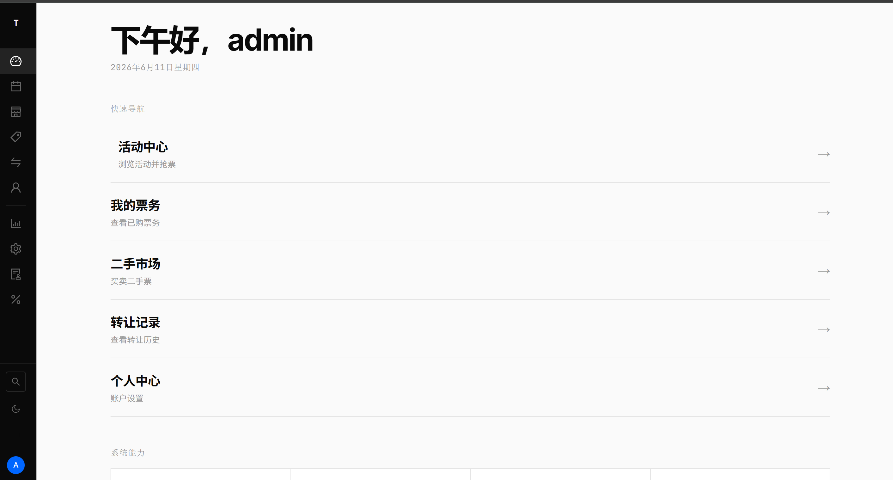
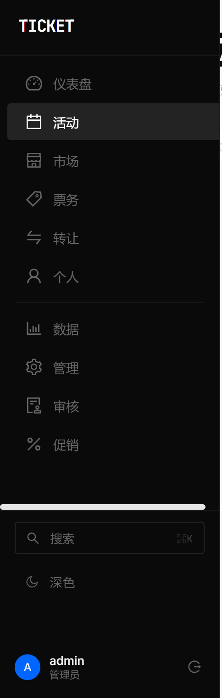
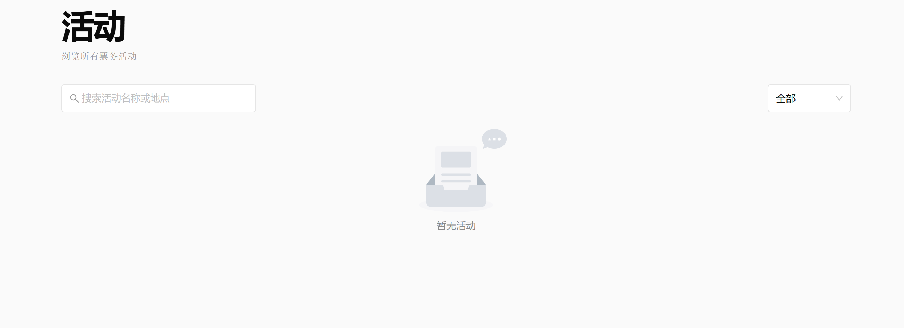
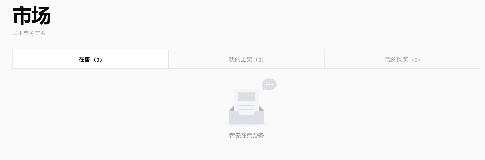
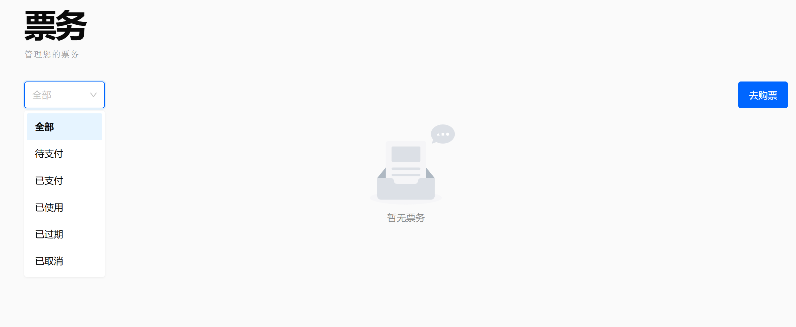
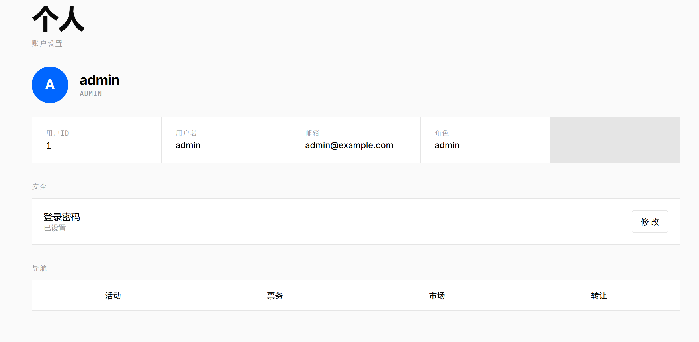
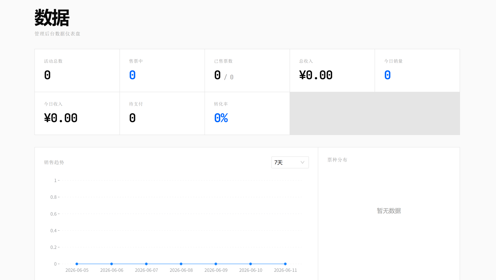
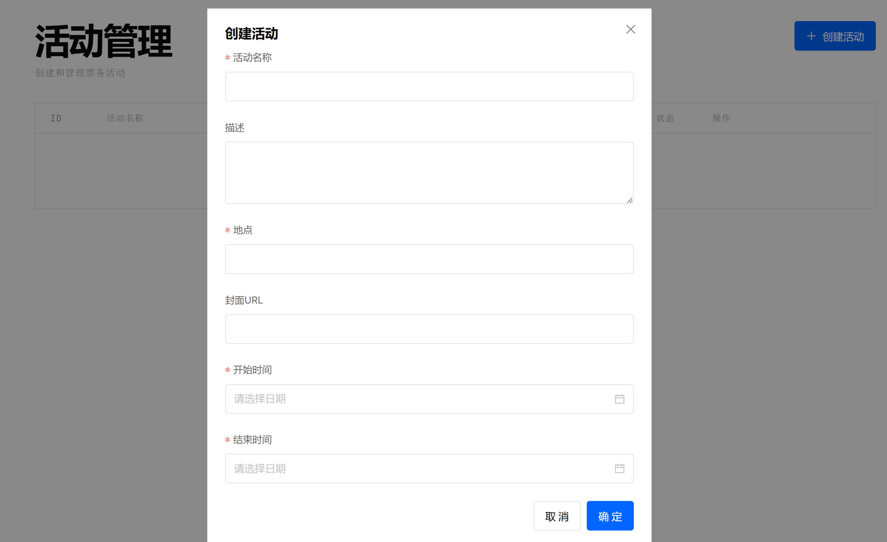
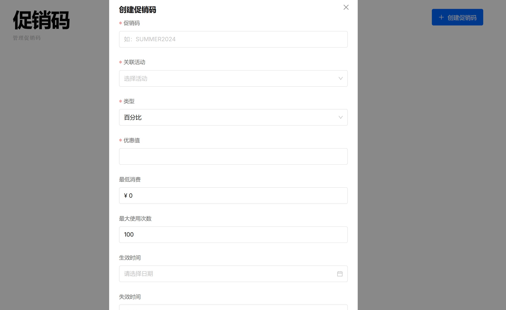

# 分布式票务抢购系统 (Cloud-Native Microservices Edition)

## 项目文档

---

## 系统效果展示 📸

以下为本系统的部分核心前端界面与功能展示。通过精心设计的 UI 与微交互，我们为用户提供了极致的操作体验，同时为管理员提供了强大的数据洞察能力。

> **提示**：为呈现最佳的响应式布局效果，所有截图均取自系统高分辨率运行环境。

### 1. 系统门户与活动大厅

通过动态沉浸式设计，用户可以快速定位并抢购心仪的活动票务。


### 2. 用户授权与身份认证

基于 JWT 和黑名单校验的身份验证模块，界面清爽，反馈迅速。


### 3. 用户主页与票务资产

集中管理个人的所有票务、活动订单与动态。


### 4. 活动详情页与多场次选择

清晰展示活动详情、各类票种库存，支持多场次无缝切换，点击即可抢票。


### 5. 秒杀排队与等候大厅

在流量峰值时，系统自动将超出处理能力的请求推入等待队列，保障核心链路稳定。


### 6. 我的票务与电子检票

购票成功后生成专属防伪二维码，支持现场核销与状态追踪。


### 7. 票务转让与审核体系

解决临时行程冲突，官方支持安全、合规的票务转赠与申请系统。


### 8. 二手交易大厅

用户自由流通手中闲置票务，系统作担保，彻底斩断黄牛黑色产业链。


### 9. 数据大盘与可视化分析

管理员独享的全局经营看板，漏斗图、趋势图一览无遗，用数据驱动业务增长。


### 10. 管理员控制台与活动发布

强大的后台管理功能，支持丰富的促销码规则与库存实时分配策略。


### 11. 系统细节与微交互呈现

从骨架屏加载到暗黑模式的无缝切换，处处体现企业级项目的打磨标准。


---

## 目录

- [一、项目概述](#一项目概述)
- [二、技术栈](#二技术栈)
- [三、核心架构设计](#三核心架构设计)
- [四、项目目录结构](#四项目目录结构)
- [五、微服务与核心业务流转](#五微服务与核心业务流转)
- [六、分布式基础设施](#六分布式基础设施)
- [七、可观测性与监控](#七可观测性与监控)
- [八、云原生部署指南 (K8s)](#八云原生部署指南-k8s)
- [九、本地开发与快速启动](#九本地开发与快速启动)
- [十、功能清单与演进路线](#十功能清单与演进路线)

---

## 一、项目概述

本项目是一个**高并发分布式票务抢购系统**，采用前后端分离架构（Go + React）。经历了全面的**云原生微服务架构（Microservices）升级**，系统已从初期的单体架构重构为包含 API 网关、订单、秒杀、后台管理、长连接推送等多个微服务组件的大型分布式系统。

### 🌟 微服务架构核心亮点

1. **分布式微服务解耦 (Microservices Split)**
   
   - 业务逻辑全面拆分为 `API 网关`、`Order`、`Seckill`、`Admin` 和 `WS Gateway` 独立微服务，支持各模块按需进行独立水平扩容。

2. **企业级消息总线 (Kafka Event-Driven)**
   
   - 引入 **Kafka** 替代轻量级队列，承担海量订单秒杀后的异步削峰填谷，彻底解耦“扣减库存”与“创建订单”的强依赖链路。

3. **极速秒杀引擎 (High-Performance Seckill)**
   
   - 基于 **Redis Lua 脚本**实现毫秒级原子扣减库存，彻底解决高并发下的超卖问题。单节点支撑万级并发，依托 Kafka 削峰，保障系统在流量洪峰下的极致高可用。

4. **分布式基础设施套件 (Distributed Infrastructure)**
   
   - **分布式 ID 生成器 (Snowflake)**：在多微服务环境下保证订单号全局唯一且有序。
   - **多级缓存 (Multi-Level Cache)**：缓解数据库瞬时并发读压力，进一步提升吞吐。

5. **全栈可观测性体系 (Full-Stack Observability)**
   
   - 全面集成 **Prometheus + Grafana** 监控指标与报警。
   - 集成 **OpenTelemetry + Jaeger** 追踪微服务间的跨服务请求链路，慢查询与系统瓶颈一览无遗。

6. **云原生容器编排 (Cloud-Native K8s)**
   
   - 提供全套 Kubernetes (K8s) 部署清单 (Deployments, Services, ConfigMaps, Ingress)，可一键部署至生产级集群。

---

## 二、技术栈

### 后端与微服务

| 技术/组件                       | 版本      | 用途            |
| --------------------------- | ------- | ------------- |
| **Go**                      | 1.24+   | 微服务开发主语言      |
| **Gin**                     | v1.12.0 | HTTP 微服务框架    |
| **Kafka (confluent-kafka)** | 3.x     | 分布式消息队列，削峰解耦  |
| **Redis**                   | 7       | 缓存、Lua 扣减、限流  |
| **PostgreSQL**              | 15      | 持久化关系型数据库     |
| **WebSocket (gorilla)**     | v1.5.3  | 实时推送，状态下发     |
| **Snowflake**               | -       | 分布式全局唯一 ID 生成 |
| **JWT**                     | v5.2.1  | 网关与微服务无状态认证   |

### 可观测性与运维 (DevOps & Observability)

| 技术/组件                      | 用途                     |
| -------------------------- | ---------------------- |
| **Kubernetes (K8s)**       | 容器编排、服务发现、负载均衡         |
| **Docker Compose**         | 本地快速联合调试编排             |
| **Prometheus**             | 采集 QPS、接口延时等性能 Metrics |
| **Grafana**                | 性能监控与业务大盘可视化           |
| **Jaeger + OpenTelemetry** | 微服务分布式请求链路追踪           |
| **GitHub Actions**         | 自动化 CI/CD 测试与打包        |

### 前端

| 技术                 | 版本         | 用途         |
| ------------------ | ---------- | ---------- |
| React 18 + Vite    | 18.2 / 5.1 | 现代化前端工程化底座 |
| TypeScript         | 5.3.3      | 类型安全保障     |
| Ant Design 5.x     | 5.15.0     | 企业级 UI 组件库 |
| Zustand            | 4.5.0      | 轻量级高性能状态管理 |
| @ant-design/charts | 2.6.7      | 数据看板可视化组件  |

---

## 三、核心架构设计

### 3.1 微服务系统架构图

```text
                                    ┌────────────────────────┐
                                    │     React Frontend     │
                                    └───────────┬────────────┘
                                                │ (HTTPS / WSS)
                                    ┌───────────▼────────────┐
                                    │    API Gateway & BFF   │
                                    │ (Rate Limiting, Auth)  │
                                    └─┬─────────┬──────────┬─┘
                                      │         │          │
           ┌──────────────────────────┘         │          └──────────────────────────┐
           ▼                                    ▼                                     ▼
┌─────────────────────┐               ┌─────────────────────┐               ┌─────────────────────┐
│    Seckill Svc      │               │     Order Svc       │               │     Admin Svc       │
│ (Lua 极速扣减库存)  │               │ (订单生命周期管理)  │               │ (报表、活动全生命管理)│
└─────────┬───────────┘               └─────────┬───────────┘               └─────────┬───────────┘
          │                                     │                                     │
          ▼                                     │                                     │
┌─────────────────────┐                         │                                     │
│   Kafka Msg Queue   │◄────────────────────────┘                                     │
│ (Topic: orders_new) │                                                               │
└─────────┬───────────┘                                                               │
          │                                                                           │
          ▼                                     ▼                                     ▼
┌─────────────────────────────────────────────────────────────────────────────────────────────┐
│                                   PostgreSQL 15 (Master/Slave)                              │
└─────────────────────────────────────────────────────────────────────────────────────────────┘
                                                ▲
                                                │
                                    ┌───────────┴────────────┐
                                    │     WS Gateway Svc     │
                                    │ (WebSocket 抢票结果下发)│
                                    └────────────────────────┘
```

---

## 四、项目目录结构

重构后的目录结构遵循 Go 标准项目布局（Standard Go Project Layout），专为多应用微服务设计：

```text
├── cmd/                             # 微服务程序入口
│   ├── admin/main.go                # 后台管理服务入口
│   ├── api/main.go                  # API Gateway / BFF 入口
│   ├── order/main.go                # 订单业务服务入口
│   ├── seckill/main.go              # 秒杀业务服务入口
│   └── ws-gateway/main.go           # WebSocket 实时推送网关
├── internal/                        # 内部业务逻辑代码
│   ├── config/                      # 统一配置加载
│   ├── gateway/                     # 网关路由与负载逻辑
│   ├── handler/                     # 各微服务的 HTTP Handlers
│   ├── middleware/                  # 全局中间件（限流、鉴权、日志、Metrics）
│   ├── mq/                          # 消息队列消费者与生产者封装
│   ├── pkg/                         # 内部可复用的基础工具包
│   │   ├── cache/                   # 多级缓存实现
│   │   ├── db/                      # PostgreSQL 连接池初始化
│   │   ├── idgen/                   # 雪花算法全局 ID 生成器
│   │   ├── kafka/                   # Kafka Client 封装
│   │   ├── redis/                   # Redis Client 与 Lua 脚本管理
│   │   ├── otel/                    # 分布式链路追踪探针
│   ├── repository/                  # 数据库 DAO 数据访问层
│   └── service/                     # 领域业务服务核心逻辑
├── k8s/                             # Kubernetes 容器编排部署文件
│   ├── admin-deployment.yaml
│   ├── order-deployment.yaml
│   ├── seckill-deployment.yaml
│   ├── ws-gateway-deployment.yaml
│   ├── configmap.yaml
│   ├── ingress.yaml                 # 集群统一外部访问入口
│   └── poddisruptionbudget.yaml
├── migrations/                      # 数据库 SQL 迁移文件
├── monitoring/                      # 可观测性套件配置 (Prometheus, Grafana)
├── web/                             # React 现代化前端工程
├── docker-compose.yml               # 本地一键启动联合调试文件
└── .github/workflows/               # 自动化构建测试 CI 管道
```

---

## 五、微服务与核心业务流转

### 5.1 微服务职能划分

- **API 网关 (cmd/api)**：系统的统一入口。负责 IP 限流、路由分发、JWT Token 校验与解析、跨域处理，并合并部分微服务请求响应（BFF 模式）。
- **秒杀服务 (cmd/seckill)**：专为千万级高并发设计。只做两件事：Redis Lua 脚本原子扣减库存，以及生成带有全局唯一雪花 ID 的订单消息发往 Kafka。
- **订单服务 (cmd/order)**：系统的事务核心。消费 Kafka 消息，执行数据库层面的真实扣减（解决防超卖最终一致性），生成真实订单记录，处理支付与过期订单的定时补偿回收。
- **管理服务 (cmd/admin)**：内部管理端。负责创建活动、分配票种库存、审核二手转让，以及通过聚合查询提供数据大盘能力。
- **WebSocket 网关 (cmd/ws-gateway)**：与用户建立长连接。订单服务异步落库成功后，通过内部机制通知 WS 网关，主动将“抢票成功”的喜悦瞬间推送到前端。

### 5.2 全链路异步秒杀流程

1. **流量拦截**：API 网关接收用户抢票请求，触发 `SeckillRateLimitMiddleware` (用户级限流) 与 IP 限频。
2. **极速校验**：请求路由至 **Seckill 服务**，在 Redis 内存中进行黑白名单及库存校验。
3. **Lua 原子扣减**：执行 Redis Lua 脚本，原子化地实现“查库存 -> 查重复购买记录 -> 扣减库存 -> 记录购买用户”。
4. **分布式 ID 与投递**：为该请求通过 `idgen` 分配全局唯一的 Snowflake Order ID，将完整的下单事件（User, Event, TicketType, OrderID）投递至 **Kafka** 队列 (`topic: orders_create`)，立即给前端返回“正在排队出票中”。
5. **异步消费落库**：**Order 服务**以批量消费模式订阅 Kafka。在内部通过 GORM 执行事务，持久化 Ticket 订单，并扣减 PostgreSQL 数据库中的真实可用库存。
6. **实时触达**：订单落库成功，Order 服务通过内网 RPC 或发布/订阅机制通知 **WS 网关**，网关根据连接池精确定位用户 Channel，主动下发成功消息，前端展示抢票成功！

---

## 六、分布式基础设施

### 6.1 雪花算法分布式 ID (Snowflake)

在微服务架构下，自增主键无法满足全局业务诉求。系统引入了 Snowflake ID 生成器 (`internal/pkg/idgen`)，保证：

- 全局唯一性，无惧分库分表。
- 趋势递增，最大程度保证 B+ 树索引插入效率。
- 高性能生成，仅涉及内存位运算，无任何网络损耗。

### 6.2 Redis Lua 与缓存防击穿

- 针对活动详情等热点读取数据，采用 `internal/pkg/cache` 包装的多级缓存（本地内存 LRU + Redis），避免缓存雪崩。
- 库存扣减全面交由 Redis Lua 代理，规避了高并发下事务隔离级别导致的死锁与性能瓶颈。

---

## 七、可观测性与监控

新架构不再是黑盒运行，我们在 `monitoring/` 和 `internal/middleware/` 实现了企业级可观测三剑客：

1. **Prometheus 性能监控**：所有微服务自动通过 `/metrics` 端点暴露 Go 运行时监控（Goroutines, GC）及业务级监控（HTTP QPS, 接口响应延迟 Histogram, Kafka 消费延迟）。
2. **Grafana 数据大盘**：内置 Grafana Dashboard 配置，运维人员可直观查看整个分布式矩阵的健康度、流量尖刺与饱和度。
3. **OpenTelemetry 分布式追踪**：请求经过 API 网关时被注入 TraceID，随着 HTTP 头与 Kafka Header 在微服务间流转。最终汇聚到 **Jaeger** 控制台，帮助开发人员瞬间锁定产生慢调用的微服务环节。

---

## 八、云原生部署指南 (K8s)

项目包含完善的 Kubernetes 资源定义文件（位于 `k8s/` 目录），适合直接在 Minikube 或生产级 K8s 集群中部署。

### 8.1 环境依赖

- Kubernetes 集群 (v1.22+)
- 预先配置好的持久化卷与外围组件 (PostgreSQL, Redis, Kafka)，或使用 Helm 快速拉起。

### 8.2 部署步骤

```bash
# 1. 部署配置与密钥
kubectl apply -f k8s/configmap.yaml
kubectl apply -f k8s/secret.yaml

# 2. 部署无状态微服务集群
kubectl apply -f k8s/admin-deployment.yaml
kubectl apply -f k8s/order-deployment.yaml
kubectl apply -f k8s/seckill-deployment.yaml
kubectl apply -f k8s/ws-gateway-deployment.yaml

# 3. 配置容灾保护与入口网关
kubectl apply -f k8s/poddisruptionbudget.yaml
kubectl apply -f k8s/ingress.yaml
```

部署完成后，Kubernetes 将自动接管微服务的重启、自动伸缩以及负载均衡服务。

---

## 九、本地开发与快速启动

为了方便个人学习与快速体验，系统依旧保留了便捷的 Docker Compose 联合调试配置。

### 环境准备

- Go 1.24+
- Node.js 18+ (用于编译 React)
- Docker Desktop (用于拉起 DB/Redis/Kafka/Jaeger/Prometheus)

### 一键启动中间件

```bash
# 在项目根目录，拉起所有依赖基础组件
docker-compose up -d
```

### 启动后端微服务集群

你需要分别启动核心服务（可以打开多个终端）：

```bash
go run cmd/api/main.go
go run cmd/order/main.go
go run cmd/seckill/main.go
go run cmd/admin/main.go
go run cmd/ws-gateway/main.go
```

### 启动 React 前端

```bash
cd web
npm install
npm run dev
```

前端将默认运行在 `http://localhost:5173`。

---

## 十、功能清单与演进路线

| 里程碑        | 功能模块                      | 状态  |
| ---------- | ------------------------- |:---:|
| **基础建设**   | 用户认证 (JWT + 黑名单)          | ✅   |
|            | 活动与场次 CRUD                | ✅   |
|            | 票种管理与票务体系                 | ✅   |
| **高并发秒杀**  | Redis Lua 库存扣减            | ✅   |
|            | Kafka 分布式消息异步削峰           | ✅   |
|            | Snowflake 分布式 ID          | ✅   |
|            | WebSocket 高可用状态推送         | ✅   |
| **防黄牛策略**  | 流量防刷 (IP+用户级双重限流)         | ✅   |
|            | 排队等候大厅与退单重分配              | ✅   |
|            | 实名与限购策略强制绑定               | ✅   |
| **微服务化改造** | API Gateway / BFF 服务集成    | ✅   |
|            | 多模块独立拆分与服务通信              | ✅   |
|            | OpenTelemetry 链路追踪集成      | ✅   |
| **基础设施**   | 接入 Kubernetes 生产级编排       | ✅   |
|            | Prometheus + Grafana 业务看板 | ✅   |
| **高级业务形态** | 安全合规的票务转让 (转赠/审核)         | ✅   |
|            | 官方去中介化二手交易大厅              | ✅   |
|            | 自动化促销码优惠抵扣引擎              | ✅   |
| **现代化前端**  | AntD 5 全面适配与定制化主题         | ✅   |
|            | CommandPalette 全局快捷控制台    | ✅   |
|            | 丝滑骨架屏与暗黑模式深度切换            | ✅   |

---
